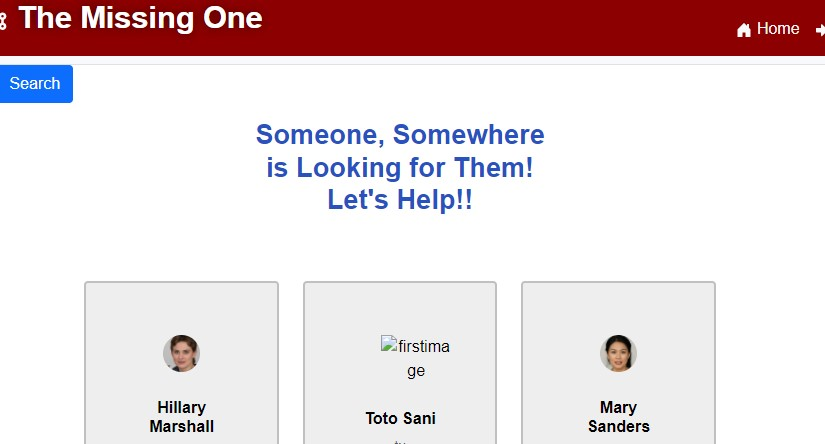

# The Missing One

  

  

  ## Description
  This project was inspired by a tragic loss that one of the members of the team experienced a short time ago.  Each year, the news is flooded with instances of missing persons.  Though there are many organizations out there that are dedicated to find such missing persons, we believed that a social media platform such as this could be benificial toward finding missing persons before the tragic occurs.  This application is built utilizing the MERN stack (MongoDB, Express.js, React, Node.js).
  
  ## Link
  [The Missing One](https://lit-scrubland-68499.herokuapp.com/)
  
  Live demo: https://lit-scrubland-68499.herokuapp.com/
  
  ## Table of Contents
  
  * [Installation](#installation)
  * [Usage](#usage)
  * [License](#license)
  * [Contributing](#contributing)
  * [Tests](#tests)
  * [Questions](#questions)
  
  ## Installation
  
  If you wish to create a similar application, you can clone the code in this repository.  Note that this is just a demonstration project and not truly in use.  You would need to replace the environmental key-value pairs with those of your choosing if you with to duplicate this project.  If you wish to experiment with the live version of this project, just navigate to the link listed elsewhere in this file.
  
  ## Usage
  
  If you clone this project for use on your local machine, once you have installed the necessary node packages in all directories and have acquired your environment variables, input 'npm run develop' from the command line in the root folder of the project.  After the application starts up, navigate to 'localhost:3000' to begin using the application.  If you choose to use the live application, navigate to it using the provided link.  Whichever path you choose, once you are at the application's homepage, you can sign up and begin viewing, commenting on, and creating cases.  (Note once again that this should not be used to create real missing persons cases at this time!)
  
  ## License
  
  The content of this project is licensed under the [MIT License](https://opensource.org/licenses/MIT).  Please click [here](https://opensource.org/licenses/MIT) for more information about how you may use code in this project.

  ## Contributing

  Like was indicated earlier in this document, this is just a demonstration project.  However, if you would like to contact one or more of the project developers with insights on how to improve the project, please feel free to do so.
  
  
  ## Tests
  
  There were no structured tests used in creating this project; instead, we performed extensive trial and error and console logging of troubled procedures until we determined solutions for specific problems.
  
  ## Questions
  [GitHub Profile: Ghalia](http://github.com/ghaliarose89) | 
  [GitHub Profile: Ivonne](http://github.com/Ivonnor1975) | 
  [GitHub Profile: Sonali](http://github.com/sonali-sohoni) | 
  [GitHub Profile: Cabral](http://github.com/cabralwilliams)
  
  For any questions concerning this application, please contact us at any of the following email addresses: ghaliarose89@gmail.com, Ivonnor@gmail.com, sonali.sohoni@gmail.com, cabral.williams@gmail.com.
